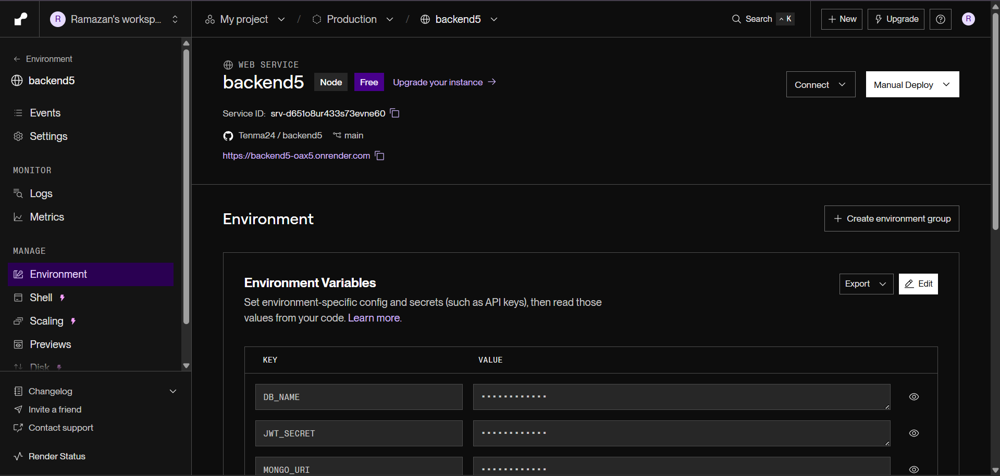
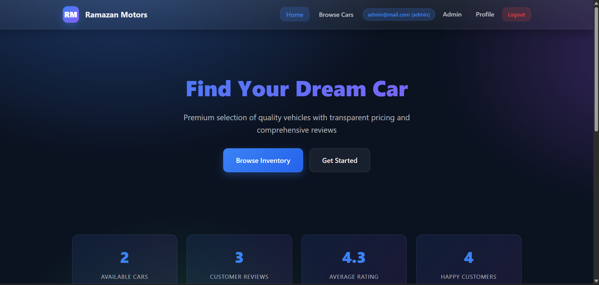
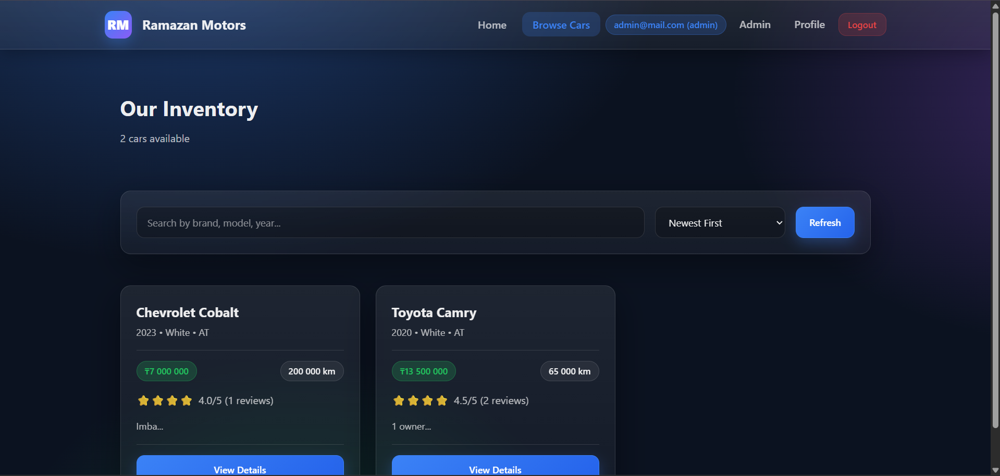
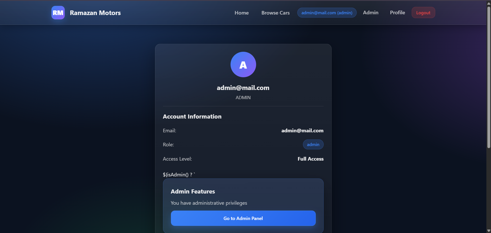
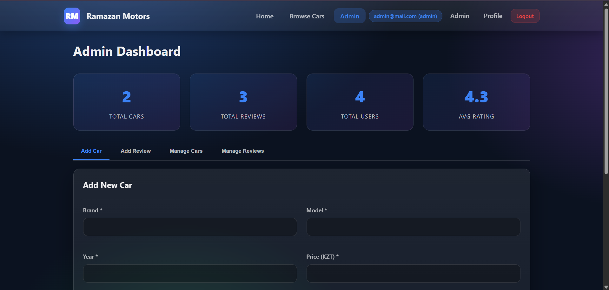

# AutoDealer  Final Project 
# Nurlan Ramazan SE-2431

## Introduction
This final project is the culmination of my work from the previous assignments. I transformed my modular, authenticated Node.js/Express API into a production-ready **Full-Stack Application**. The application includes a functional user interface, secure authentication, role-based access control (RBAC), and a MongoDB database with correctly linked objects. The project is deployed online and accessible via public URL(s), as required.

## Project Topic
**AutoDealer / Car Catalog Platform**  
Users can browse a catalog of cars and interact with public content (reviews). Administrators can perform sensitive actions such as managing cars and moderating content.

---

## How This Meets the Final Project Criteria

### 1) Advanced Backend Completion
- **Full Logic Implementation:** All API endpoints required for the project theme are operational (Auth + Cars + Reviews + Stats).
- **Relational Integrity:** Multiple objects are correctly linked in MongoDB:
  - **Users** (authentication, roles)
  - **Cars** (catalog items)
  - **Reviews** (linked to cars and (if implemented) users)
- **Advanced Middleware (RBAC):**
  - **Admins** can perform sensitive actions (create/update/delete cars, review moderation).
  - **Users** interact with public content (view catalog, create reviews depending on implemented rules).
- **Validation & Error Handling:** Input validation is implemented in controllers, and errors are handled consistently via middleware.

### 2) Frontend Integration
- **Authentication Flow:** Login/registration forms store a **JWT** and use it for authorized requests.
- **State Management:** The UI uses JavaScript `fetch()` to call the API and dynamically update the UI.
- **Responsive Design:** The UI is structured to work across different screen sizes.

### 3) Deployment & Production
- **Backend Deployment:** Deployed to **Render** (or similar platform), accessible via a public URL.
- **Frontend Deployment:** Integrated frontend is served as static files from the Express server (deployed together).
- **Environment Variables:** Sensitive configuration is stored in `.env` (MongoDB URI, JWT secret).

---

## Tech Stack
- **Backend:** Node.js, Express.js  
- **Database:** MongoDB, Mongoose  
- **Auth:** JWT, bcrypt  
- **Frontend:** HTML, CSS, Vanilla JavaScript (Fetch API)  
- **Deployment:** Render  

---

## Folder Structure (MVC)
```txt
/models        -> Mongoose schemas (User, Car, Review)
/controllers   -> Business logic (Auth, Cars, Reviews, Stats)
/routes        -> API routes
/middleware    -> auth (JWT), isAdmin (RBAC), error handling
/public        -> Frontend HTML/CSS/JS (static files served by Express)
server.js      -> Server entry point
app.js         -> Express app configuration
```

---

## Environment Variables

Create a `.env` file in the root directory (do not commit it to GitHub). Example:

```env
PORT=3000
MONGO_URI=your_mongodb_connection_string
DB_NAME=autodealer_db
JWT_SECRET=your_secret_key
```

---

## API Endpoints

### Auth
- `POST /api/auth/register` — Register a new user
- `POST /api/auth/login` — Login and receive JWT

### Cars
- `GET /api/cars` — Public: list cars
- `GET /api/cars/:id` — Public: get car by id (if implemented)
- `POST /api/cars` — Admin only: create car
- `PUT /api/cars/:id` — Admin only: update car
- `DELETE /api/cars/:id` — Admin only: delete car (and related reviews if implemented)

### Reviews
- `GET /api/reviews` — Public: list reviews
- `GET /api/reviews/:id` — Public: get review by id (if implemented)
- `POST /api/reviews` — Auth required: create review (user interaction with public content)
- `PUT /api/reviews/:id` — Owner/Admin (depending on implementation): update review
- `DELETE /api/reviews/:id` — Owner/Admin (depending on implementation): delete review

### Stats
- `GET /api/stats` — Public: basic stats for landing page (cars count, reviews count, featured cars, etc.)

---

## How to Run Locally

1. Install dependencies:
```bash
npm install
```

2. Create `.env` (see Environment Variables section).

3. Start the server:
```bash
npm start
```
(or `node server.js`)

4. Open the app:
```
http://localhost:3000
```

---

## Deployment (Render)

1. Push the project to GitHub.
2. Create a new Web Service on Render.
3. Set **Build Command**:
```bash
npm install
```
4. Set **Start Command**:
```bash
node server.js
```
(or `npm start`)

5. Add environment variables in Render dashboard:
   - `MONGO_URI`
   - `DB_NAME`
   - `JWT_SECRET`
   - `PORT` (optional; Render sets PORT automatically)

6. Deploy and open the public URL.



---

## Postman Collection

A Postman collection is included to test all production endpoints:
- Register
- Login
- Cars CRUD (admin)
- Reviews operations
- Stats endpoint

(Attach file: `postman_collection.json`)

---

## Screenshots (Placeholders)









---

## Explaination

- **MVC structure** and how requests flow from routes → controllers → models
- **JWT authentication:** token creation, storage, and usage in `Authorization: Bearer <token>`
- **RBAC:** how admin-only routes are protected using middleware
- **Relational integrity in MongoDB:** linking reviews to cars (and users if implemented)
- **Deployment steps** and environment variable usage

---

## Conclusion

This project demonstrates a complete full-stack workflow: building a secure modular API, connecting it to a functional frontend, enforcing RBAC, maintaining relational integrity in MongoDB, and deploying the final product publicly. It satisfies the final project requirements for integration, deployment, code quality, and explainability for the final defense.
